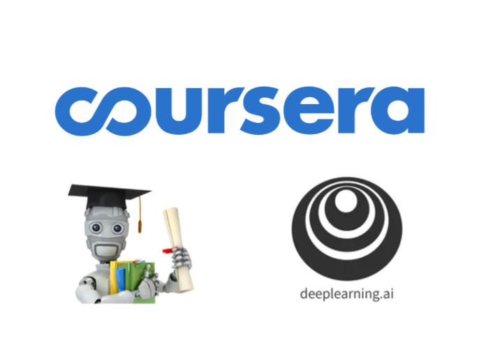

  

# Introduction

This repository contains all my work for [Machine Learning](https://www.coursera.org/learn/machine-learning?)
and [Deep Learning Specialization](https://www.coursera.org/specializations/deep-learning) on Coursera.

Certications:

- [Machine Learning](https://www.coursera.org/account/accomplishments/verify/QGJ4DPCP9XW2)
- [Structuring Machine Learning Projects](https://www.coursera.org/account/accomplishments/verify/F7FJG6Z8BF5F)
- [Neural Networks and Deep Learning](https://www.coursera.org/account/accomplishments/verify/682DNPEDUL7J)
- [Improving Deep Neural Networks: Hyperparameter tuning, Recognition and Optimization](https://www.coursera.org/account/accomplishments/verify/W7G4XK5GR74U)
- [Convolutional Neural Networks](https://www.coursera.org/account/accomplishments/verify/9KG8A23QYPLH)

If there is any problems regarding jupyter notebook loading on github, copy paste the link to [jupyter notebook nbviewer](https://nbviewer.jupyter.org/).

# Personal Notes

You can find my personal notes on my [website](https://ferdinandmom.engineer/machine-learning/)

# Lab Assignments

## Machine Learning

- Week 2 - LA 1 - [Linear Regression](https://github.com/3outeille/Coursera-Labs/tree/master/Machine%20Learning/Lab%20Assignment%201%20-%20Linear%20Regression)
- Week 3 - LA 2 - [Logistic Regression](https://github.com/3outeille/Coursera-Labs/tree/master/Machine%20Learning/Lab%20Assignment%202%20-%20Logistic%20Regression)
- Week 4 - LA 3 - [Multi-class Classification and Neural Networks](https://github.com/3outeille/Coursera-Labs/tree/master/Machine%20Learning/Lab%20Assignment%203%20-%20Multi-class%20Classification%20and%20Neural%20Networks)
- Week 5 - LA 4 - [Neural Networks Learning](https://github.com/3outeille/Coursera-Labs/tree/master/Machine%20Learning/Lab%20Assignment%204%20-%20Neural%20Networks%20Learning)
- Week 6 - LA 5 - [Regularized Linear Regression and Bias v.s. Variance](https://github.com/3outeille/Coursera-Labs/tree/master/Machine%20Learning/Lab%20Assignment%205%20-%20Regularized%20Linear%20Regression%20and%20Bias%20v.s.%20Variance)
- Week 7 - LA 6 - [Support Vector Machines](https://github.com/3outeille/Coursera-Labs/tree/master/Machine%20Learning/Lab%20Assignment%206%20-%20Support%20Vector%20Machines)
- Week 8 - LA 7 - [K-means Clustering and Principal Component Analysis](https://github.com/3outeille/Coursera-Labs/tree/master/Machine%20Learning/Lab%20Assignment%207%20-%20K-means%20Clustering%20and%20Principal%20Component%20Analysis)
- Week 9 - LA 8 - [Anomaly Detection and Recommender Systems](https://github.com/3outeille/Coursera-Labs/tree/master/Machine%20Learning/Lab%20Assignment%208%20-%20Anomaly%20Detection%20and%20Recommender%20Systems)

## Deep Learning Specialization

- Neural Networks and Deep Learning

    - Week 2 - LA 1 - [Logistic Regression with a Neural Network mindset](https://github.com/3outeille/Coursera-Labs/blob/master/Neural%20Networks%20and%20Deep%20Learning/Logistic_Regression_with_a_Neural_Network_mindset_v6a.ipynb)
    - Week 3 - LA 2 - [Planar data classification with one hidden layer](https://github.com/3outeille/Coursera-Labs/blob/master/Neural%20Networks%20and%20Deep%20Learning/Planar_data_classification_with_onehidden_layer_v6c.ipynb)
    - Week 4 - LA 3 - [Building your Deep Neural Network: Step by Step](https://github.com/3outeille/Coursera-Labs/blob/master/Neural%20Networks%20and%20Deep%20Learning/Building_your_Deep_Neural_Network_Step_by_Step_v8a.ipynb)
    - Week 4 - LA 4 - [Deep Neural Network for Image Classification: Application](https://github.com/3outeille/Coursera-Labs/blob/master/Neural%20Networks%20and%20Deep%20Learning/Deep_Neural_Network_Application_v8.ipynb)

- Improving Deep Neural Networks: Hyperparameter tuning, Regularization and Optimization

    - Week 1 - LA 1 - [Initialization](https://github.com/3outeille/Coursera-Labs/blob/master/Improving%20Deep%20Neural%20Networks%20Hyperparameter%20tuning%2C%20Regularization%20and%20Optimization/Initialization.ipynb)
    - Week 1 - LA 2 - [Regularization](https://github.com/3outeille/Coursera-Labs/blob/master/Improving%20Deep%20Neural%20Networks%20Hyperparameter%20tuning%2C%20Regularization%20and%20Optimization/Regularization_v2a.ipynb)
    - Week 1 - LA 3 - [Gradient Checking](https://github.com/3outeille/Coursera-Labs/blob/master/Improving%20Deep%20Neural%20Networks%20Hyperparameter%20tuning%2C%20Regularization%20and%20Optimization/Gradient%2BChecking%2Bv1.ipynb)
    - Week 2 - LA 4 - [Optimization Methods](https://github.com/3outeille/Coursera-Labs/blob/master/Improving%20Deep%20Neural%20Networks%20Hyperparameter%20tuning%2C%20Regularization%20and%20Optimization/Optimization_methods_v1b.ipynb)
    - Week 3 - LA 5 - [TensorFlow Tutorial](https://github.com/3outeille/Coursera-Labs/blob/master/Improving%20Deep%20Neural%20Networks%20Hyperparameter%20tuning%2C%20Regularization%20and%20Optimization/TensorFlow_Tutorial_v3b.ipynb)

- Convolutional Neural Networks
    - Week 1 - LA 1 - [Convolutional Model: step by step](https://github.com/3outeille/Coursera-Labs/blob/master/Convolutional%20Neural%20Networks/Convolution_model_Step_by_Step_v2a.ipynb)
    - Week 1 - LA 2 - [Convolutional Model: application](https://github.com/3outeille/Coursera-Labs/blob/master/Convolutional%20Neural%20Networks/Convolution_model_Application_v1a.ipynb)
    - Week 2 - LA 3 - [Keras - Tutorial](https://github.com/3outeille/Coursera-Labs/blob/master/Convolutional%20Neural%20Networks/Keras_Tutorial_v2a.ipynb)
    - Week 2 - LA 4 - [Residual Networks](https://github.com/3outeille/Coursera-Labs/blob/master/Convolutional%20Neural%20Networks/Residual_Networks_v2a.ipynb)
    - Week 3 - LA 5 - [Car detection with YOLO](https://github.com/3outeille/Coursera-Labs/blob/master/Convolutional%20Neural%20Networks/Autonomous_driving_application_Car_detection_v3a.ipynb)
    - Week 4 - LA 6 - [Art generation with Neural Style Transfer](https://github.com/3outeille/Coursera-Labs/blob/master/Convolutional%20Neural%20Networks/Art_Generation_with_Neural_Style_Transfer_v3a.ipynb)
    - Week 4 - LA 7 - [Face Recognition](https://github.com/3outeille/Coursera-Labs/blob/master/Convolutional%20Neural%20Networks/Face_Recognition_v3a.ipynb)
